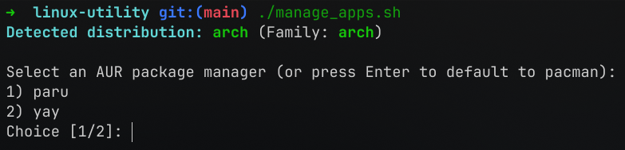
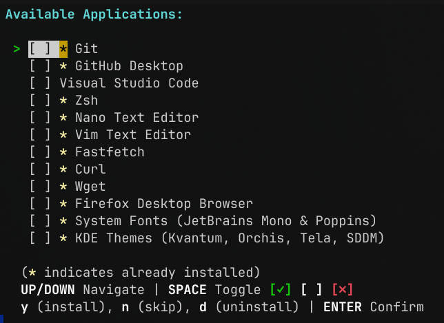
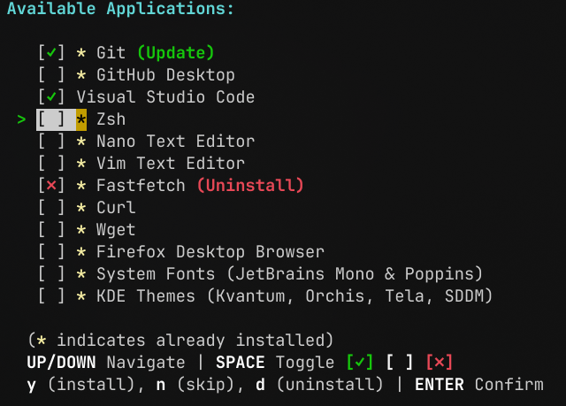
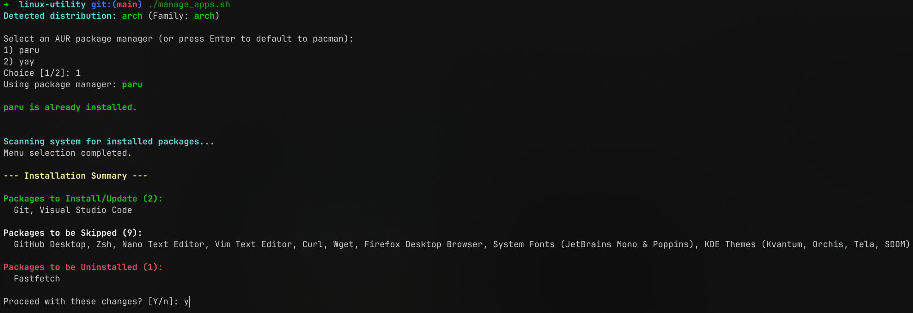
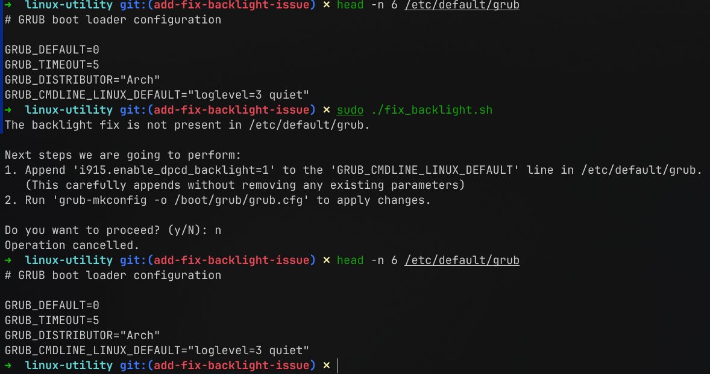
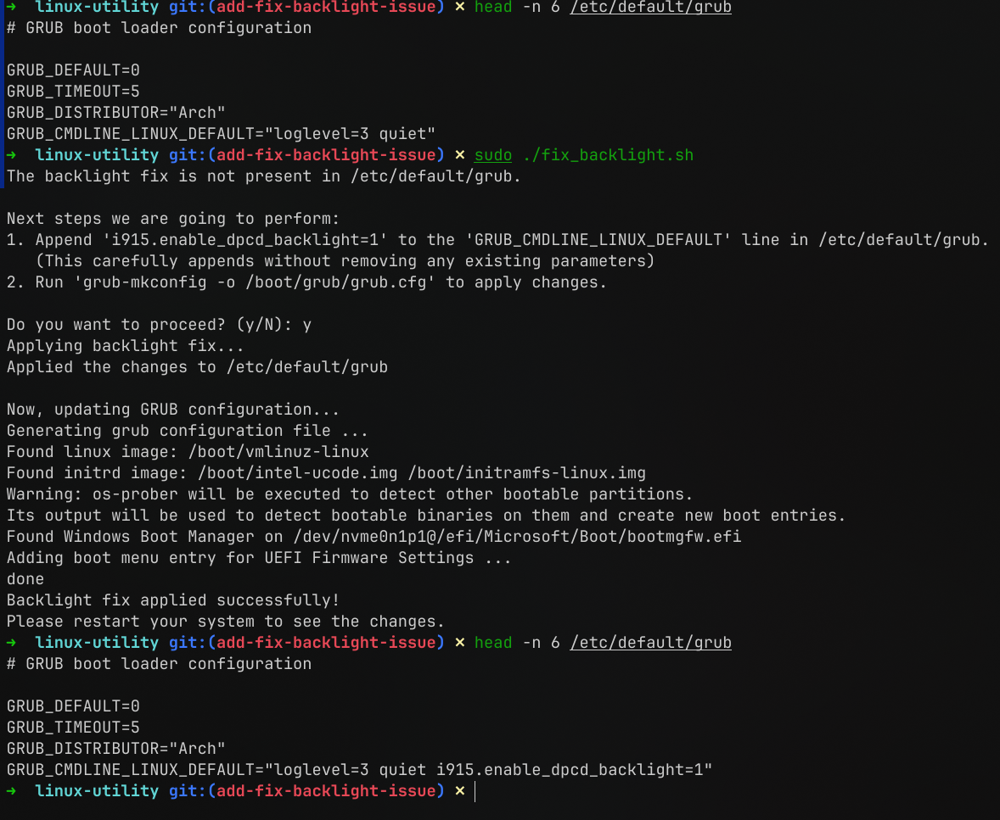
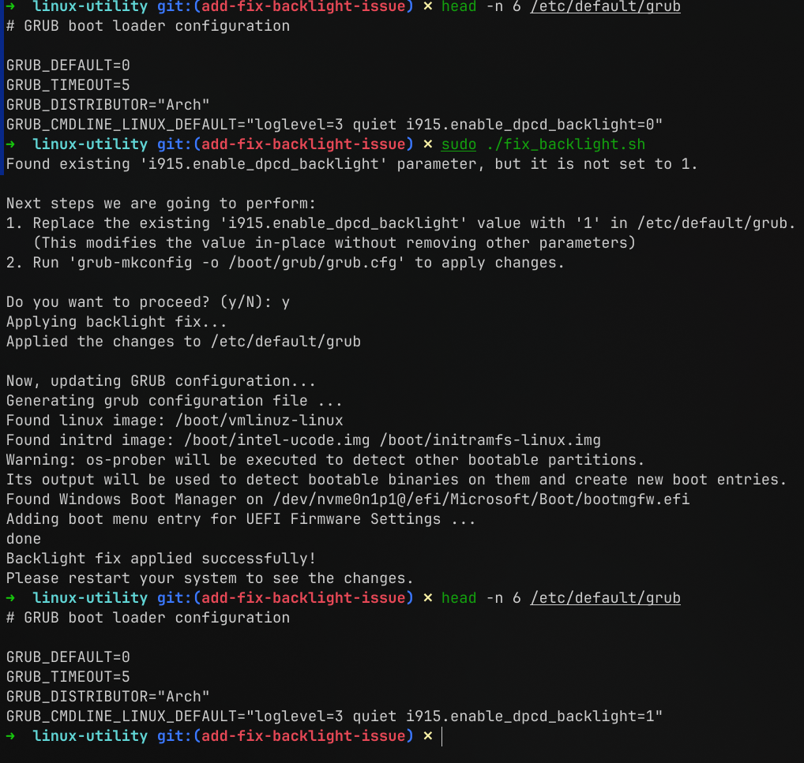
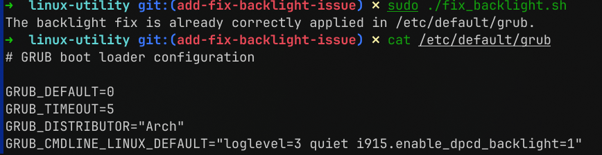

# Linux Utility

A fast, modular, and interactive CLI utility designed to seamlessly install, update, and manage essential software across various Linux distributions, along with built-in scripts to resolve common system configuration issues. 

## Features

- **Cross-Distribution Support:** Automatically detects your OS family (Arch, Debian, or Fedora) and routes actions to the correct native package manager (`pacman`, `apt`, `dnf`).
- **Interactive 3-State Menu:** An elegant TUI that allows you to cleanly mark packages for Installation/Update, Skipping, or Uninstallation.
- **Intelligent Presence Detection:** Actively scans your system and visually flags already-installed software with an asterisk (`*`).
- **Engineered Safeguards:** Hard-coded modular blockers prevent the accidental uninstallation of critical graphical and desktop environments (like custom Fonts and KDE Themes).

## Setup

1. **Clone the repository**

```bash
git clone https://github.com/nikhilavula/linux-utility.git
```

2. **Navigate to the directory**
```bash
cd linux-utility
```

---

## Utilities

<details>
<summary><strong>📦 Manage Apps</strong></summary>
<br>

**Run the manager:**

```bash
./manage_apps.sh
```

### Installation & Navigation

- **AUR Helper (Arch Linux Only):** You will be prompted to select an AUR helper (e.g. `yay` or `paru`). You can press `Enter` to default back to standard `pacman`. 
  - *Note: If you select an AUR helper that isn't currently installed, the manager will automatically bootstrap and install it for you.*



- **Application Selection:** You will enter the interactive software TUI. 
  - Use **UP/DOWN** arrow keys to navigate the list.
  - Press **SPACE** to cycle the state of the package: `[✓]` (Install/Update) -> `[ ]` (Skip) -> `[✗]` (Uninstall).
  - Alternatively, use hotkeys: **y** (Install), **n** (Skip), or **d** (Uninstall).
  - *Note: Packages marked with an asterisk (`*`) are heavily implied to be already installed on your system. Selecting them will trigger an update stream.*





- **Confirmation:** Once you have curated your desired setup, press **ENTER**. You will be presented with a highly condensed, comma-separated overview of all pending operations to prevent UI clutter.



- **Execution:** Type `y` or simply hit Enter to start process of installation / updating / deletion of apps.

</details>

<details>
<summary><strong>🔅 Fix Backlight</strong></summary>
<br>

A targeted script to automatically fix screen brightness controls for Intel graphics displays by safely enforcing the `i915.enable_dpcd_backlight=1` Grub parameter.

**Run the fix utility (Requires Sudo):**

```bash
sudo ./fix_backlight.sh
```

### Script Behaviors

- **Review & Confirm:** Displays an exact summary of what modifications it intends to perform on `/etc/default/grub` and awaits your confirmation before modifying your system.
  <br>
  
- **Safe Appends:** Retains all of your pre-existing GRUB configuration and gracefully appends the fix to the end if it's missing.
  <br>
  

- **Value Overrides:** If the parameter already exists with an incorrect value (e.g., `=0`), the script surgically targets and replaces only that value without duplication.
  <br>
  

- **No Fix Needed:** Automatically detects if the fix is already correctly applied and exits harmlessly.
  <br>
  

</details>
